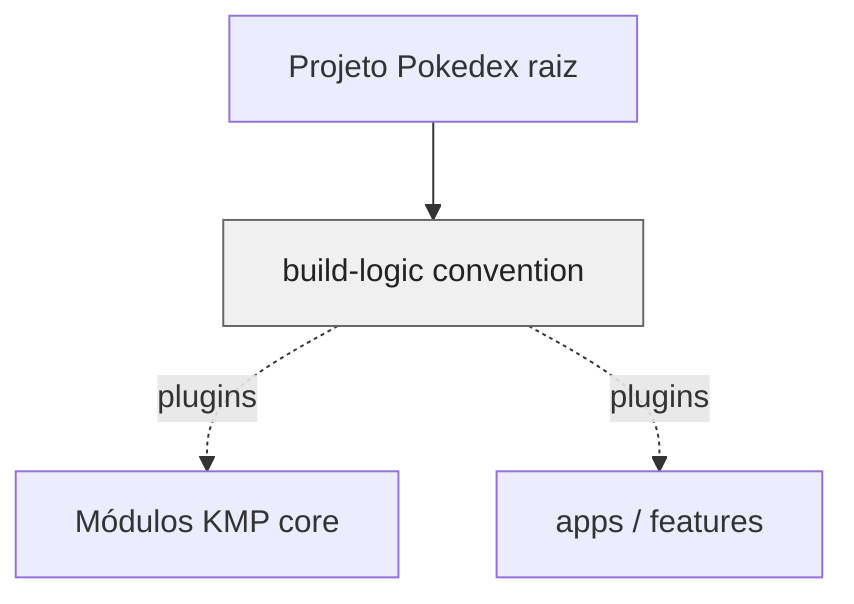

# `build-logic` — convenções Gradle

`build-logic` é um **included build** (`includeBuild("build-logic")` no `settings.gradle.kts` da raiz) que concentra **plugins Kotlin DSL** reutilizados pelos módulos do Pokedex. O objetivo é **uma única fonte de verdade** para multiplataforma, Android, Compose, Koin, Room e Ktor — em vez de copiar blocos `plugins { }` e `kotlin { }` em cada `build.gradle.kts`.

---

## Estrutura

| Projeto | Função |
|---------|--------|
| **`:convention`** | Implementa os plugins publicados em `gradlePlugin { }` e depende de `compileOnly` dos plugins Android, Kotlin, Compose e Room para **compilar** contra as APIs corretas. |

O catálogo de versões (`libs`) continua na raiz em `build-logic/gradle/libs.versions.toml` (referenciado pelo `dependencyResolutionManagement`); os plugins aqui **consomem** esse catálogo via accessors.

---

## Plugins expostos (resumo)

| ID (conceito) | Classe | O que aplica |
|---------------|--------|----------------|
| **foundation.project** | `KmpProjectPlugin` | Kotlin Multiplatform, `explicitApi`, JVM, iOS (`iosArm64`, `iosSimulatorArm64`) com **framework** por módulo, dependências comuns de teste. |
| **foundation.library.comp** | `LibraryComposePlugin` | Biblioteca KMP com **Compose** (compiler, recursos Android quando aplicável). |
| **foundation.library.koin** | `LibraryKoinPlugin` | Convenções para módulos com **Koin** (anotações / geração). |
| **foundation.library.room** | `LibraryRoomPlugin` | Convenções **Room** no KMP. |
| **foundation.library.ktor** | `LibraryKtorPlugin` | Convenções **Ktor Client** no KMP. |

Os IDs exatos vêm de `libs.plugins.foundation.*` no version catalog — ver [`convention/build.gradle.kts`](convention/build.gradle.kts) para o mapeamento `id` → `implementationClass`.

---

## Módulos relacionados

---

## Decisões que importam

### Included build isolado

Mudanças em convenções **recompilam** só o `build-logic`, sem poluir o código de produto — e os módulos aplicam `alias(libs.plugins.foundation.*)` de forma uniforme.

### `compileOnly` nos plugins Gradle

Os plugins referenciam as APIs dos plugins externos em **compileOnly** para não arrastar dependências desnecessárias para o classpath dos módulos de aplicação.

### KMP alinhado ao produto

`KmpProjectPlugin` fixa alvos **jvm** + **iOS** e opções como `-Xexpect-actual-classes`, alinhado ao que o Pokedex precisa para compartilhar código entre Android, Desktop e iOS.

---

## Ligações úteis

| Documento | Conteúdo |
|-----------|----------|
| [README raiz](../README.md) | Arquitetura do app e como compilar. |
| [`settings.gradle.kts`](../settings.gradle.kts) | `includeBuild("build-logic")` e estrutura de módulos. |
